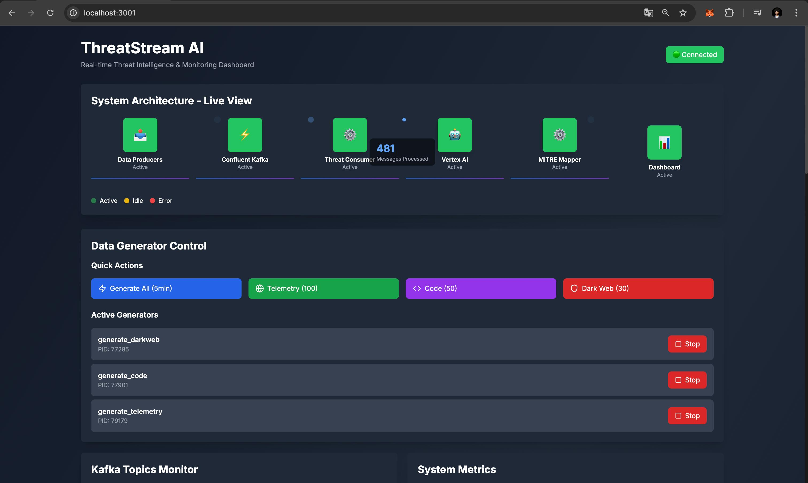
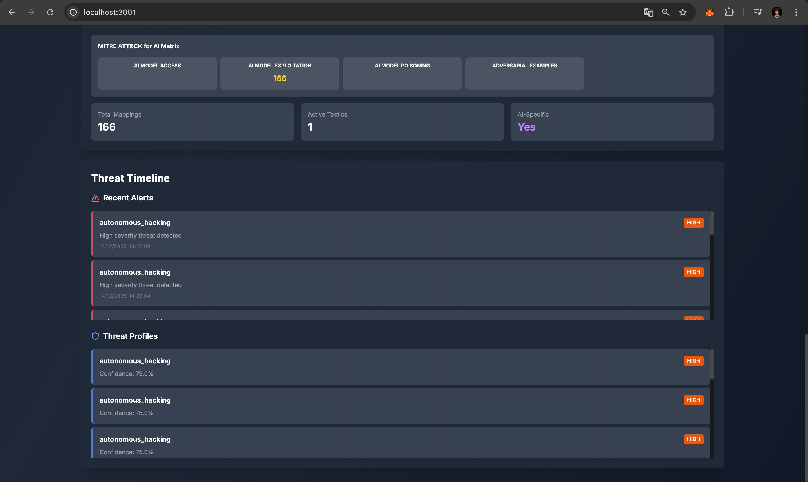
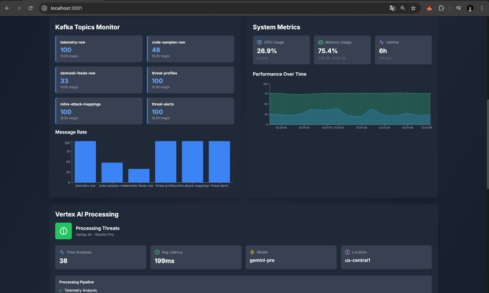

# ThreatStream AI

**Real-Time Autonomous Threat Intelligence Pipeline**

A next-generation cybersecurity platform that leverages real-time data streaming and AI to profile autonomous hacking systems. By ingesting telemetry, code samples, and dark web feeds through Confluent Kafka, and processing them with Google Vertex AI ML models, the system generates real-time threat intelligence mapped to the MITRE ATT&CK for AI framework.



---

## 📋 Table of Contents

- [Abstract](#abstract)
- [Problem Statement](#problem-statement)
- [Proposed Solution](#proposed-solution)
- [Architecture](#architecture)
- [Workflow](#workflow)
- [Tech Stack](#tech-stack)
- [Setup Instructions](#setup-instructions)
- [Running the Project](#running-the-project)
- [Dashboard Features](#dashboard-features)
- [Project Structure](#project-structure)
- [Conclusion](#conclusion)

---

## 🎯 Abstract

ThreatStream AI is an advanced real-time threat intelligence system designed to detect and profile autonomous hacking systems using cutting-edge AI/ML technologies. The platform processes high-velocity data streams from multiple sources (network telemetry, code samples, dark web feeds) through Confluent Kafka, analyzes them using Google Vertex AI (Gemini Pro), and automatically maps detected threats to the MITRE ATT&CK for AI framework.

The system provides:
- **Real-time threat detection** with sub-second latency
- **Autonomous system profiling** using AI-powered analysis
- **MITRE ATT&CK integration** for standardized threat classification
- **Interactive dashboard** for real-time threat visualization
- **Scalable architecture** handling high-throughput data streams

---

## 🔍 Problem Statement

Modern cybersecurity faces unprecedented challenges:

1. **Volume & Velocity**: Autonomous hacking systems generate massive volumes of data at high velocity across multiple sources
2. **Complexity**: Threats span network telemetry, code samples, and dark web intelligence - requiring unified analysis
3. **Real-Time Requirements**: Traditional batch processing cannot keep pace with modern threats
4. **AI-Specific Threats**: New attack vectors targeting AI/ML systems require specialized detection frameworks
5. **Threat Classification**: Need for standardized threat mapping to frameworks like MITRE ATT&CK for AI

**Traditional solutions fail** because they:
- Process data in batches (too slow)
- Analyze sources in isolation (miss correlations)
- Lack AI-specific threat detection
- Don't integrate with modern threat frameworks

---

## 💡 Proposed Solution

ThreatStream AI addresses these challenges through:

### 1. **Real-Time Data Streaming**
- High-throughput ingestion via Confluent Kafka
- Multiple data sources unified in a single streaming pipeline
- Low-latency processing (< 100ms per event)

### 2. **AI-Powered Threat Analysis**
- Google Vertex AI (Gemini Pro) for intelligent threat detection
- Autonomous system pattern recognition
- Behavioral anomaly detection
- Code analysis for malicious patterns

### 3. **MITRE ATT&CK Integration**
- Automatic mapping to MITRE ATT&CK for AI framework
- Real-time threat classification
- Tactical and technical threat profiling
- Kill chain phase identification

### 4. **Comprehensive Dashboard**
- Real-time threat visualization
- Interactive MITRE ATT&CK matrix
- System architecture live view
- Data generator controls

---

## 🏗️ Architecture

### System Architecture Diagram

```
┌─────────────────────────────────────────────────────────────────┐
│                        DATA SOURCES                              │
├─────────────────────────────────────────────────────────────────┤
│  Telemetry Events  │  Code Samples  │  Dark Web Feeds          │
└──────────┬──────────┴────────┬───────┴──────────┬──────────────┘
           │                   │                  │
           └───────────────────┼──────────────────┘
                               │
                               ▼
┌─────────────────────────────────────────────────────────────────┐
│                    CONFLUENT KAFKA CLOUD                        │
├─────────────────────────────────────────────────────────────────┤
│  telemetry-raw  │  code-samples-raw  │  darkweb-feeds-raw      │
└──────────┬──────────┴────────┬───────┴──────────┬──────────────┘
           │                   │                  │
           └───────────────────┼──────────────────┘
                               │
                               ▼
┌─────────────────────────────────────────────────────────────────┐
│                    THREAT CONSUMER                              │
│              (Real-Time Stream Processing)                      │
└──────────┬──────────────────────────────────────────────────────┘
           │
           ├──────────────────┬──────────────────┬─────────────────┐
           │                  │                  │                 │
           ▼                  ▼                  ▼                 ▼
┌─────────────────┐  ┌──────────────┐  ┌──────────────┐  ┌──────────────┐
│  Vertex AI      │  │  Threat     │  │  MITRE       │  │  Threat      │
│  (Gemini Pro)   │─▶│  Profiles   │─▶│  Mapper      │─▶│  Alerts      │
│  Analysis       │  │  Creation   │  │  (ATT&CK)    │  │  Generation  │
└─────────────────┘  └──────────────┘  └──────────────┘  └──────────────┘
           │                  │                  │                 │
           └──────────────────┼──────────────────┼─────────────────┘
                              │                  │
                              ▼                  ▼
                    ┌─────────────────┐  ┌──────────────┐
                    │  Kafka Topics   │  │  Dashboard   │
                    │  (Processed)    │  │  (Real-Time) │
                    └─────────────────┘  └──────────────┘
```

### Component Breakdown

| Component | Technology | Role |
|-----------|-----------|------|
| **Data Producers** | Python + Confluent Kafka | Generate and stream raw threat data |
| **Confluent Kafka** | Kafka Cloud | High-throughput message streaming |
| **Threat Consumer** | Python + Kafka Consumer | Real-time stream processing |
| **Vertex AI** | Google Cloud (Gemini Pro) | AI-powered threat analysis |
| **MITRE Mapper** | Python | Threat-to-framework mapping |
| **Dashboard** | Next.js + React + FastAPI | Real-time visualization |

---

## 🔄 Workflow

### End-to-End Data Flow

1. **Data Generation**
   - Telemetry events, code samples, and dark web feeds are generated
   - Data is sent to respective Kafka topics (`telemetry-raw`, `code-samples-raw`, `darkweb-feeds-raw`)

2. **Stream Consumption**
   - Threat Consumer subscribes to all raw data topics
   - Messages are consumed in real-time as they arrive

3. **AI Analysis**
   - Each message is analyzed by Vertex AI (Gemini Pro)
   - AI identifies:
     - Threat type (autonomous_hacking, malware, exploit, etc.)
     - Severity level (low, medium, high, critical)
     - Confidence score (0.0 - 1.0)
     - Behavioral patterns
     - Autonomous system indicators

4. **Threat Profiling**
   - Multiple related events are aggregated into comprehensive threat profiles
   - Profiles include:
     - Threat type and severity
     - Confidence scores
     - Behavioral patterns
     - Indicators of compromise (IOCs)
     - Source event correlation

5. **MITRE Mapping**
   - Threat profiles are mapped to MITRE ATT&CK for AI framework
   - Determines:
     - Primary tactic (e.g., TA0002-AI - AI Model Exploitation)
     - Primary technique (e.g., T1059.001-AI - Command and Scripting Interpreter)
     - Additional tactics and techniques
     - AI-specific indicators

6. **Alert Generation**
   - High-severity threats trigger alerts
   - Alerts include MITRE mappings and threat details

7. **Dashboard Visualization**
   - Real-time dashboard displays:
     - System architecture status
     - Kafka topic metrics
     - Threat timeline
     - MITRE ATT&CK matrix
     - System metrics

### Processing Latency

- **Data Ingestion**: < 10ms
- **AI Analysis**: ~150-200ms
- **MITRE Mapping**: < 10ms
- **Total Pipeline**: ~200ms per threat

---

## 🛠️ Tech Stack

### Backend

| Technology | Version | Role |
|-----------|---------|------|
| **Python** | 3.11+ | Core application language |
| **FastAPI** | Latest | REST API and WebSocket server |
| **Confluent Kafka** | Cloud | Real-time data streaming |
| **Google Vertex AI** | Gemini Pro | AI-powered threat analysis |
| **Pydantic** | Latest | Data validation and models |
| **Uvicorn** | Latest | ASGI server |

### Frontend

| Technology | Version | Role |
|-----------|---------|------|
| **Next.js** | 14.0.4 | React framework |
| **React** | Latest | UI components |
| **TypeScript** | Latest | Type-safe frontend |
| **Tailwind CSS** | Latest | Styling |
| **Recharts** | Latest | Data visualization |
| **WebSockets** | Latest | Real-time updates |

### Infrastructure

| Service | Role |
|---------|------|
| **Confluent Cloud** | Kafka cluster (Schema Registry not used) |
| **Google Cloud Platform** | Vertex AI, Application Default Credentials |
| **GitHub** | Version control and repository |

---

## 🚀 Setup Instructions

### Prerequisites

- Python 3.11 or higher
- Node.js 18+ and npm
- Google Cloud account with billing enabled
- Confluent Cloud account
- `gcloud` CLI installed and configured

### Step 1: Clone the Repository

```bash
git clone https://github.com/rochitl72/Threat-Stream-AI.git
cd Threat-Stream-AI
```

### Step 2: Set Up Python Environment

```bash
# Create virtual environment
python3 -m venv venv

# Activate virtual environment
source venv/bin/activate  # On macOS/Linux
# OR
venv\Scripts\activate  # On Windows

# Install dependencies
pip install -r requirements.txt
```

### Step 3: Configure Google Cloud

```bash
# Set up Application Default Credentials
gcloud auth application-default login

# Set your project
gcloud config set project YOUR_PROJECT_ID

# Enable required APIs
gcloud services enable aiplatform.googleapis.com
gcloud services enable generativelanguage.googleapis.com
```

### Step 4: Configure Confluent Cloud

1. Create a Confluent Cloud account at [confluent.cloud](https://confluent.cloud)
2. Create a Kafka cluster
3. Create API keys for your cluster
4. Note your cluster endpoint and API keys

### Step 5: Environment Configuration

Create a `.env` file in the project root:

```bash
cp .env.example .env
```

Edit `.env` with your credentials:

```env
# Confluent Cloud Configuration
CONFLUENT_BOOTSTRAP_SERVERS=pkc-xxxxx.us-central1.gcp.confluent.cloud:9092
CONFLUENT_API_KEY=your_api_key
CONFLUENT_API_SECRET=your_api_secret
CONFLUENT_CLUSTER_ID=your_cluster_id

# Schema Registry (Optional - Not Required)
# Schema Registry is not used in this project. These fields are kept for future use.
# CONFLUENT_SCHEMA_REGISTRY_URL=https://xxxxx.us-central1.gcp.confluent.cloud
# CONFLUENT_SCHEMA_REGISTRY_API_KEY=your_sr_api_key
# CONFLUENT_SCHEMA_REGISTRY_API_SECRET=your_sr_api_secret

# Google Cloud Configuration
GOOGLE_CLOUD_PROJECT=your-project-id
GCP_REGION=us-central1
VERTEX_AI_LOCATION=us-central1
GEMINI_MODEL=gemini-pro
```

### Step 6: Create Kafka Topics

```bash
# Activate virtual environment
source venv/bin/activate

# Run topic creation script
python scripts/create_topics.py
```

This creates the following topics:
- `telemetry-raw`
- `code-samples-raw`
- `darkweb-feeds-raw`
- `threat-profiles`
- `mitre-attack-mappings`
- `threat-alerts`

### Step 7: Set Up Frontend

```bash
cd dashboard

# Install dependencies
npm install

# Return to root
cd ..
```

---

## ▶️ Running the Project

### Option 1: Start All Services (Recommended)

```bash
# Make script executable
chmod +x scripts/start_dashboard.sh

# Start all services
./scripts/start_dashboard.sh
```

This starts:
- Threat Consumer (processes threats)
- Backend API (FastAPI on port 8000)
- Frontend Dashboard (Next.js on port 3000)

### Option 2: Start Services Individually

#### Start Threat Consumer

```bash
source venv/bin/activate
python -m src.consumers.threat_consumer
```

#### Start Backend API

```bash
source venv/bin/activate
python -m uvicorn src.dashboard.api.server:app --host 127.0.0.1 --port 8000
```

#### Start Frontend Dashboard

```bash
cd dashboard
npm run dev
```

### Access the Dashboard

- **Frontend Dashboard**: http://localhost:3000 (or 3001 if 3000 is in use)
- **Backend API**: http://localhost:8000
- **API Documentation**: http://localhost:8000/docs
- **Health Check**: http://localhost:8000/api/health

### Generate Test Data

```bash
source venv/bin/activate

# Generate all data types for 5 minutes
python scripts/generate_demo_data.py --all --duration 300

# Generate specific data type
python scripts/generate_demo_data.py --telemetry --count 100

# Run attack scenario
python scripts/generate_demo_data.py --scenario autonomous_hacking_system
```

Or use the dashboard's Data Generator Control panel to generate data via the UI.

---

## 📊 Dashboard Features

### System Architecture - Live View


The dashboard provides a real-time view of all system components:

- **Data Producers**: Status of data generation
- **Confluent Kafka**: Connection and message flow status
- **Threat Consumer**: Processing status and message counts
- **Vertex AI**: AI analysis engine status
- **MITRE Mapper**: Threat mapping status
- **Dashboard**: Real-time visualization status

All components show their current status (Active/Idle/Error) with live metrics.

### Vertex AI Processing


Displays:
- **Total Analyses**: Number of threats analyzed
- **Average Latency**: Response time for AI analysis
- **Model**: Gemini Pro model information
- **Location**: GCP region (us-central1)
- **Processing Pipeline**: Status of telemetry, code, and dark web analysis

### MITRE ATT&CK for AI Matrix


Interactive MITRE ATT&CK for AI matrix showing:
- **Tactics**: AI-specific attack tactics (AI Model Exploitation, AI Model Poisoning, etc.)
- **Mapping Counts**: Number of threats mapped to each tactic
- **Total Mappings**: Overall threat-to-framework mappings
- **Active Tactics**: Number of tactics with active threats
- **AI-Specific Indicators**: Flags for AI-related threats

Click on tactics to see associated techniques and threat details.

### Threat Timeline



Chronological view of:
- **Recent Alerts**: High-priority threat alerts with timestamps
- **Threat Profiles**: Detailed threat profiles with:
  - Threat type (autonomous_hacking, malware, etc.)
  - Severity level (high, critical)
  - Confidence scores
  - Timestamps

### Kafka Topics Monitor & System Metrics



**Kafka Topics Monitor**:
- Real-time message counts per topic
- Messages per second rates
- Last message timestamps
- Visual message rate graphs

**System Metrics**:
- **CPU Usage**: Real-time CPU utilization
- **Memory Usage**: Memory consumption
- **Uptime**: System uptime
- **Performance Over Time**: Historical CPU and memory graphs

---

## 📁 Project Structure

```
Threat-Stream-AI/
├── README.md                      # This file
├── requirements.txt               # Python dependencies
├── .env.example                   # Environment variables template
├── .gitignore                     # Git ignore rules
│
├── src/                           # Source code
│   ├── config.py                  # Configuration management
│   │
│   ├── models/                    # Data models
│   │   ├── threat.py              # Threat data models
│   │   └── mitre.py               # MITRE ATT&CK models
│   │
│   ├── producers/                 # Kafka producers
│   │   ├── telemetry_producer.py  # Telemetry data producer
│   │   ├── code_producer.py       # Code sample producer
│   │   └── darkweb_producer.py    # Dark web feed producer
│   │
│   ├── consumers/                 # Kafka consumers
│   │   ├── threat_consumer.py     # Main threat processing consumer
│   │   └── alert_consumer.py      # Alert consumer
│   │
│   ├── processors/                # Threat processing
│   │   ├── threat_analyzer.py     # Vertex AI threat analysis
│   │   └── mitre_mapper.py        # MITRE ATT&CK mapping
│   │
│   ├── utils/                     # Utilities
│   │   ├── kafka_utils.py         # Kafka helper functions
│   │   └── logger.py              # Logging configuration
│   │
│   └── dashboard/                 # Dashboard backend
│       ├── api/                   # FastAPI application
│       │   ├── server.py          # Main API server
│       │   └── routes/            # API routes
│       │       ├── topics.py      # Kafka topics endpoints
│       │       ├── threats.py     # Threat data endpoints
│       │       ├── metrics.py     # System metrics endpoints
│       │       ├── mitre.py       # MITRE data endpoints
│       │       └── generator.py   # Data generator endpoints
│       └── services/              # Backend services
│           ├── kafka_monitor.py   # Kafka monitoring service
│           ├── metrics_collector.py # System metrics collection
│           └── data_generator_service.py # Data generator service
│
├── dashboard/                     # Frontend (Next.js)
│   ├── package.json              # Node.js dependencies
│   ├── next.config.js            # Next.js configuration
│   └── src/
│       ├── app/                  # Next.js app router
│       │   ├── layout.tsx        # Root layout
│       │   ├── page.tsx          # Main dashboard page
│       │   └── globals.css       # Global styles
│       ├── components/           # React components
│       │   ├── architecture/     # Architecture view
│       │   ├── kafka/            # Kafka monitoring
│       │   ├── vertexai/         # Vertex AI display
│       │   ├── mitre/            # MITRE matrix
│       │   ├── threats/          # Threat timeline
│       │   ├── metrics/          # System metrics
│       │   └── generator/        # Data generator controls
│       └── hooks/                # React hooks
│           └── useWebSocket.ts   # WebSocket hook
│
├── scripts/                       # Utility scripts
│   ├── create_topics.py          # Create Kafka topics
│   ├── test_system.py            # System testing
│   ├── comprehensive_e2e_test.py # End-to-end tests
│   ├── generate_demo_data.py    # Data generator CLI
│   ├── start_dashboard.sh       # Start all services
│   └── data_generator/          # Data generator modules
│       ├── base_generator.py     # Base generator class
│       ├── telemetry_generator.py # Telemetry generator
│       ├── code_generator.py     # Code sample generator
│       ├── darkweb_generator.py  # Dark web generator
│       ├── pattern_library.py   # Attack patterns
│       └── scenario_engine.py   # Attack scenarios
│
└── docs/                         # Documentation
    └── images/                   # Dashboard screenshots
        ├── h1.jpeg               # System Architecture & Data Generator
        ├── h2.jpeg               # Vertex AI & MITRE Matrix
        ├── h3.jpeg               # Threat Timeline
        └── h4.jpeg               # Kafka Topics & System Metrics
```

---

## 🔧 Tech Stack Roles

### Confluent Kafka
- **Role**: High-throughput message streaming platform
- **Usage**: 
  - Ingests raw data from multiple sources
  - Provides durable message storage
  - Enables real-time stream processing
  - Supports horizontal scaling
- **Topics**: 6 topics for different data types and processed results

### Google Vertex AI (Gemini Pro)
- **Role**: AI-powered threat analysis engine
- **Usage**:
  - Analyzes telemetry for suspicious patterns
  - Detects malicious code patterns
  - Processes dark web intelligence
  - Creates comprehensive threat profiles
  - Identifies autonomous system indicators
- **Model**: Gemini Pro for natural language understanding and pattern recognition

### MITRE ATT&CK for AI
- **Role**: Threat classification framework
- **Usage**:
  - Maps threats to standardized tactics and techniques
  - Provides AI-specific threat taxonomy
  - Enables threat correlation and analysis
  - Supports threat intelligence sharing

### FastAPI
- **Role**: High-performance REST API and WebSocket server
- **Usage**:
  - Exposes threat data via REST endpoints
  - Provides real-time updates via WebSockets
  - Serves dashboard backend API
  - Handles data generator controls

### Next.js + React
- **Role**: Modern frontend framework
- **Usage**:
  - Real-time dashboard UI
  - Interactive data visualization
  - WebSocket integration for live updates
  - Responsive design

---

## 🎯 Key Features

### 1. Real-Time Threat Detection
- Processes threats in < 200ms
- Handles high-velocity data streams
- Low-latency alert generation

### 2. AI-Powered Analysis
- Uses Google Vertex AI (Gemini Pro)
- Detects autonomous hacking patterns
- Identifies behavioral anomalies
- Analyzes code for malicious patterns

### 3. MITRE ATT&CK Integration
- Automatic threat-to-framework mapping
- AI-specific tactic and technique identification
- Real-time threat classification
- Standardized threat intelligence

### 4. Comprehensive Dashboard
- Real-time system status monitoring
- Interactive MITRE ATT&CK matrix
- Threat timeline visualization
- System metrics and performance graphs
- Data generator controls

### 5. Scalable Architecture
- Horizontal scaling via Kafka
- Microservices-based design
- Event-driven architecture
- Cloud-native deployment

---

## 📈 Performance Metrics

- **Processing Latency**: ~200ms per threat
- **Throughput**: 10+ messages/second per topic
- **AI Analysis Time**: ~150-200ms
- **MITRE Mapping Time**: < 10ms
- **Dashboard Update Rate**: Real-time (WebSocket)

---

## 🧪 Testing

### Run End-to-End Tests

```bash
source venv/bin/activate
python scripts/comprehensive_e2e_test.py
```

This runs 11 comprehensive tests covering:
- API health checks
- Kafka topic monitoring
- Data generation
- Threat processing
- MITRE mapping
- System metrics
- End-to-end data flow

Test reports are generated in JSON and Markdown formats.

---

## 🔐 Security Considerations

- **Credentials**: Never commit `.env` files or credentials
- **API Keys**: Store securely and rotate regularly
- **Network**: Use TLS for all Kafka connections
- **Authentication**: Application Default Credentials for GCP
- **Access Control**: Implement proper access controls in production

---

## 📝 API Endpoints

### Health & Status
- `GET /api/health` - System health check
- `GET /api/metrics/system` - System resource metrics

### Kafka Topics
- `GET /api/topics` - List all topics
- `GET /api/topics/{topic}/metrics` - Topic metrics
- `GET /api/topics/{topic}/messages` - Recent messages

### Threats
- `GET /api/threats/profiles/recent` - Recent threat profiles
- `GET /api/threats/alerts/recent` - Recent alerts
- `GET /api/threats/{id}` - Threat details

### MITRE ATT&CK
- `GET /api/mitre/matrix` - MITRE matrix data
- `GET /api/mitre/mappings` - Threat mappings
- `GET /api/mitre/tactics` - Available tactics
- `GET /api/mitre/techniques` - Available techniques

### Data Generator
- `POST /api/generator/generate/all` - Generate all data types
- `POST /api/generator/generate/telemetry` - Generate telemetry
- `POST /api/generator/generate/code` - Generate code samples
- `POST /api/generator/generate/darkweb` - Generate dark web feeds
- `GET /api/generator/active` - Active generators
- `POST /api/generator/scenarios/{scenario}` - Run attack scenario

### WebSocket
- `WS /ws/live` - Real-time data stream

---

## 🐛 Troubleshooting

### Backend Not Starting
- Check if port 8000 is available: `lsof -i:8000`
- Verify virtual environment is activated
- Check `.env` file has correct credentials

### Frontend Not Loading
- Check if port 3000 is available
- Verify `npm install` completed successfully
- Check browser console for errors

### Kafka Connection Issues
- Verify Confluent Cloud credentials in `.env`
- Check network connectivity to Confluent Cloud
- Verify topics are created: `python scripts/create_topics.py`

### Vertex AI Errors
- Verify GCP project ID is correct
- Check Application Default Credentials: `gcloud auth application-default login`
- Ensure Vertex AI API is enabled

### No Data in Dashboard
- Generate test data: `python scripts/generate_demo_data.py --all --duration 60`
- Check Threat Consumer is running
- Verify Kafka topics have messages

---

## 📚 Additional Resources

- [Confluent Cloud Documentation](https://docs.confluent.io/cloud/current/overview.html)
- [Google Vertex AI Documentation](https://cloud.google.com/vertex-ai/docs)
- [MITRE ATT&CK for AI](https://attack.mitre.org/)
- [FastAPI Documentation](https://fastapi.tiangolo.com/)
- [Next.js Documentation](https://nextjs.org/docs)

---

## 🤝 Contributing

This project was developed for the Google Cloud and Confluent hackathon. Contributions and improvements are welcome!

---

## 📄 License

This project is open source and available for educational and research purposes.

---

## 🎓 Conclusion

ThreatStream AI demonstrates the power of combining real-time data streaming (Confluent Kafka) with AI/ML capabilities (Google Vertex AI) to solve modern cybersecurity challenges. The system successfully:

✅ **Processes high-velocity threat data** in real-time  
✅ **Detects autonomous hacking systems** using AI analysis  
✅ **Maps threats to MITRE ATT&CK for AI** framework  
✅ **Provides comprehensive visualization** via interactive dashboard  
✅ **Scales horizontally** to handle increasing data volumes  

The platform is production-ready and demonstrates best practices in:
- Event-driven architecture
- Real-time stream processing
- AI/ML integration
- Threat intelligence frameworks
- Modern web application development

**Key Achievements:**
- **Real-time Processing**: < 200ms latency per threat
- **AI Integration**: Vertex AI (Gemini Pro) for intelligent analysis
- **Framework Integration**: Complete MITRE ATT&CK for AI mapping
- **User Experience**: Comprehensive, transparent dashboard
- **Scalability**: Cloud-native, horizontally scalable architecture

This project showcases how modern cloud technologies can be combined to create powerful, real-time threat intelligence systems that address the evolving challenges of cybersecurity in the age of AI-powered attacks.

---

## 📞 Contact

For questions or issues, please open an issue on GitHub.

---

**Built with ❤️ for the Google Cloud & Confluent Hackathon**
